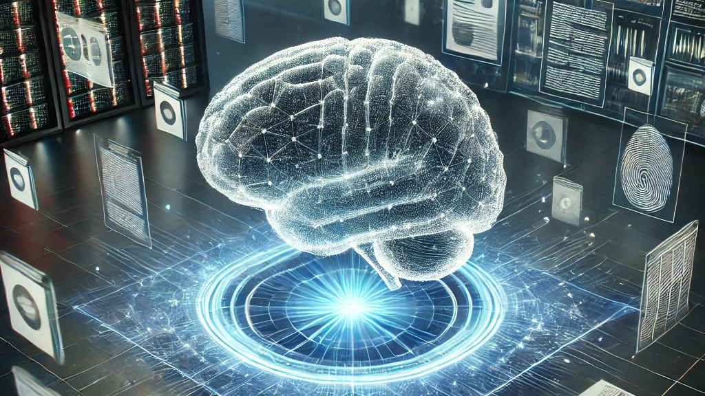

## LLM Practice
### 簡介

本專案介紹大型語言模型 Large Language Model (LLM) 的原理與技術，並挑選幾個重點進行實作。
包含以下方向：

- 多模態模型 Multimodal Model、API 應用
- 提示工程 Prompting、微調 Fine-tuning、增強式學習 Reinforcement Learning
- 檢索增強生成 RAG

文章內容請參考以下章節：

- [LLM 首部曲 - Building Applications with APIs](https://ryanccj.github.io/blog/2024/LLM-I)
- [LLM 二部曲: Prompting and Alignment (SFT+RL)](https://ryanccj.github.io/blog/2024/LLM-II)
- [LLM 三部曲 - Retrieval Augmented Generation (RAG)](https://ryanccj.github.io/blog/2024/LLM-III)

